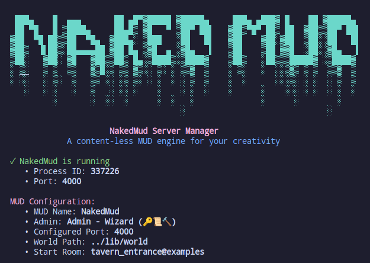

# NakedMud Documentation

Welcome to NakedMud 4.1! This documentation contains everything you need to understand, compile, run, and extend your MUD server. Whether you're a complete newcomer or an experienced developer, we've got you covered.

**Git and Submodules**
NakedMud is "contentless", any additional modules I add will be initialized as git submodules. If you are using git then once you receive all files you can use 'git submodule update --init --recursive' to grab them all, or use 'git submodule init <specific-submodule-path> && git submodule update' to grab specific ones (like the socials).

Or, you can download the latest release on the right, then go to https://github.com/NakedMud/ and download the submodules you want and place them into lib/PyModules as a subdirectory, they will auto-detect and load. Failures will show in the log.

## Quick Start

New to NakedMud? Start here:

1. **Run the installer**: `./install.py` - Interactive setup for your MUD configuration
2. **[Compiling and Running](doc/compiling_and_running.md)** - Get your MUD server up and running
3. **Start your server**: `./startmud.py` - Server manager with automatic startup and monitoring (supports `--mudlib-path` for custom library locations)
4. **[Game Library Guide](doc/game_library.md)** - Understand how your MUD's content is organized
5. **[OLC for Dummies](doc/OLC_FOR_DUMMIES.md)** - Learn to build worlds with the Online Creation system
6. **[Credits](CREDITS.md)** - Learn about the people who made NakedMud possible

## What is NakedMud?



NakedMud is a "content-less" MUD engine - it provides you with a solid, extensible foundation for building your own text-based multiplayer game, but without predefined content. Think of it as a blank canvas for your creativity!

**Key Features:**
- **Python Integration**: Write game logic in Python instead of hard-to-modify C code
- **Modular Design**: Everything is organized into clean, reusable components
- **Online Creation (OLC)**: Build your world from within the game itself
- **Modern Architecture**: Built for Python 3.12+ with contemporary development practices
- **Extensible**: Add new features without touching the core engine

## Documentation Guide

### Getting Started
- **Installation Script**: Run `./install.py` for interactive MUD configuration
- **[Compiling and Running](doc/compiling_and_running.md)** - Step-by-step setup guide with friendly explanations
- **[Game Library Guide](doc/game_library.md)** - Understanding the `lib/` directory structure and content organization
- **[OLC for Dummies](doc/OLC_FOR_DUMMIES.md)** - Fun, comprehensive guide to building with Online Creation

### Development
- **[C Coding Conventions](doc/c_coding_conventions.md)** - Essential guide to NakedMud's unique coding style
- **[NakedMud Programming](doc/nakedmud_programming.md)** - Core programming concepts and architecture
- **[Python Scripting](doc/nakedmud_python.md)** - Complete guide to Python integration and scripting
- **[Extending NakedMud](doc/extending_nakedmud.md)** - How to add new features and modules

### Reference
- **[Credits](CREDITS.md)** - Acknowledgments and project history
- **[License](LICENSE.md)** - Usage terms and attribution
- **[Example Code](doc/example-py/)** - Python examples and templates
- **[Archived Documentation](doc/archived/)** - Historical documentation and legacy guides

## Project History

NakedMud began as Geoff Hollis's personal project around 2003-2004, built on top of Brian Graversen's SocketMud. Geoff's vision was to create a MUD engine that separated the technical foundation from game content, allowing creators to focus on building worlds rather than wrestling with socket programming and low-level details.

After Geoff's passing in November 2021, development continues under Kevin Morgan (LimpingNinja) to honor his work and vision, focusing on:

- **Python 3+ Modernization**: Updated from Python 2.x to modern Python
- **Code Stabilization**: Bug fixes and improved reliability  
- **Enhanced Documentation**: Clearer guides and better organization
- **Community Support**: Maintaining the project for current and future builders

## The NakedMud Philosophy

> *"The basic idea behind NakedMud is to provide users with a solid engine for running a MUD, but without the content that goes along with it."* - Geoff Hollis

This philosophy means:

- **You control the content**: No predetermined races, classes, or storylines
- **Python handles game logic**: Write readable, maintainable game systems
- **C provides the engine**: Solid, fast core that you rarely need to touch
- **Modular everything**: Add features without breaking existing systems

## Architecture Overview

```
NakedMud Structure:
├── src/                # C engine (socket handling, core systems)
├── lib/                # Game content and Python logic
│   ├── accounts/       # Player account data storage
│   ├── help/           # In-game help system and documentation
│   ├── logs/           # Server and game logs
│   ├── misc/           # Miscellaneous configuration files
│   ├── muddata         # Core MUD configuration file
│   ├── players/        # Individual player character data
│   ├── pymodules/      # Python game systems and commands
│   ├── txt/            # Text files and templates
│   └── world/          # Zones, rooms, objects, NPCs (prototypes)
├── doc/                # Documentation and guides
└── tests/              # Test suites and validation
```

The beauty of this design is that you can create entirely different types of games using the same engine - from traditional fantasy MUDs to sci-fi adventures to social chat environments.

## Getting Help

**Documentation Issues?** Check if there's a more specific guide for your question:
- Building problems? → [Compiling and Running](doc/compiling_and_running.md)
- Code questions? → [C Coding Conventions](doc/c_coding_conventions.md) or [Python Scripting](doc/nakedmud_python.md)
- Content creation? → [Game Library Guide](doc/game_library.md) or [OLC for Dummies](doc/OLC_FOR_DUMMIES.md)
- Want to add features? → [Extending NakedMud](doc/extending_nakedmud.md)

**Still stuck?** The NakedMud community is friendly and helpful. Don't hesitate to reach out!

## Contributing

NakedMud thrives on community contributions! Whether you're:
- **Fixing bugs** in the core engine
- **Writing documentation** to help others
- **Creating example content** for new builders
- **Sharing your modifications** with the community

Your contributions help keep Geoff's vision alive and make NakedMud better for everyone.

## Original Foundations

NakedMud builds upon the excellent work of:

**SocketMud by Brian Graversen** - The original foundation that handled all the complex socket programming, allowing NakedMud to focus on the fun stuff. As Brian wrote: *"Little mud project, which has a command interpreter and supports ANSI colors... has a nifty little help file system, and a few commands (say, quit, who, etc). Also supports MCCP version 1 and 2."*

**Code Snippets by Erwin Andreasen** - Various utility functions and improvements that made their way into SocketMud and subsequently into NakedMud.

We maintain these credits not just out of courtesy, but because NakedMud's success stands on the shoulders of these generous developers who shared their work with the community.

---

*Welcome to NakedMud! Whether you're here to build your first MUD or add features to an existing one, we're excited to see what you'll create. The only limit is your imagination.*

**Happy MUDding!**
