# NakedMud OLC For Dummies 🏗️

*A Fun and Friendly Reference for the Inexperienced Builder*

---

## Welcome to the World of Building! 🎉

Hey there, future world-builder! Ready to create amazing places for players to explore? You've come to the right place! This guide will walk you through NakedMud's Online Creation (OLC) system - your magical toolkit for building zones, rooms, objects, and mobiles right from within the game.

Don't worry if you're new to this - we'll start simple and work our way up. By the end of this guide, you'll be crafting immersive worlds like a pro! 

> **💡 Pro Tip**: The OLC system creates prototype files in `lib/world/` for zones, mobs, rooms, objects, triggers, etc. While you *can* edit these files directly, OLC is the preferred and safer method for editing them.

---

## Chapter 1: Zones - Your Building Foundation 🏘️

Zones are the organizational backbone of your world-building efforts. Think of them as neighborhoods in a city - each zone groups together rooms, objects, mobiles, and triggers that work together to create a cohesive area for players to explore.

### Getting Started with Zones

If you're the first builder on your MUD, you'll start with just one example zone. Let's see what we have:

```
> zlist
```

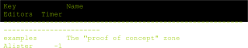

You should see something like the output above. Each zone has its own unique key for identification - think of it as the zone's address!

### Creating Your First Zone 🆕

Ready to create your own zone? The syntax is simple:

```
zedit new [key]
```

Let's create a zone that we can later connect to the existing examples zone. I'll create a seedy alley:

```
> zedit new seedy_alley
```


Boom! 💥 Your new zone is born! Let's check our zone list again:

```
> zlist
```

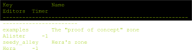

Look at that - we now have two zones! Time to configure our new creation.

### Configuring Your Zone ⚙️

Now let's edit our zone to give it personality:

```
> zedit seedy_alley
```

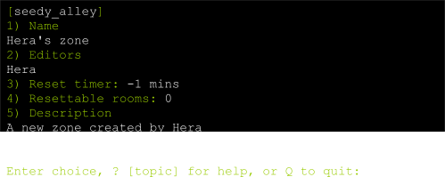

This is your zone's control panel! Let's go through each option:

#### Option 1: Zone Name 📝
This is what builders see when working with your zone. Let's give it a proper name:

```
1
A Seedy Alley
```

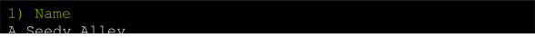

Much better! Now it has character.

#### Option 2: Building Permissions 👥
Who else can build in your zone? Add your fellow builders here (comma and space separated):

```
2
Hera, Zeus, Athena
```


Now your building buddies can help you create this masterpiece!

#### Option 3: Reset Timer ⏰
This controls how often the zone resets (respawns objects and mobiles). We'll leave this for now since we haven't created anything to reset yet.

#### Option 4: Reset Rooms Counter 📊
Shows how many rooms currently use resets. Since we're just starting, this should be 0.

#### Option 5: Zone Description 📖
This is where you can add a description that only immortals can see. It's great for explaining your zone's purpose:

```
5
```

This opens the editor. Since there's already text, clear it first:

```
/c
This is a narrow alleyway connecting the tavern and other small businesses to a main thoroughfare.
/f
/q
```

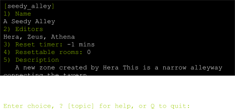

Perfect! Now other builders know what you're creating.

### Saving Your Work 💾

To complete your zone creation:

```
Q
Save changes (Y/N)? Y
```

Congratulations! 🎊 You've just created your first zone! If you followed along, you now have a shiny new zone ready for building.

> **🎯 Building Tip**: Always use descriptive zone keys and names. Future you (and other builders) will thank you for the clarity!

---

## Chapter 2: Abstract Rooms - Your Building Blueprints 📐

Abstract rooms are like architectural blueprints - they define common characteristics that multiple rooms can inherit. This is one of NakedMud's most powerful features for efficient building!

### Why Use Abstracts? 🤔

Imagine you're building a castle with 20 similar rooms. Instead of setting up each room individually, you create one abstract room with all the common features (stone walls, torch lighting, medieval atmosphere), then have your real rooms inherit from it. Genius, right?

### Creating Your First Abstract Room

Let's create an abstract for our seedy alley. Since we're planning 4 connected rooms that are all part of the same alleyway, they'll share many characteristics.

```
> redit abstract_alley@seedy_alley
```

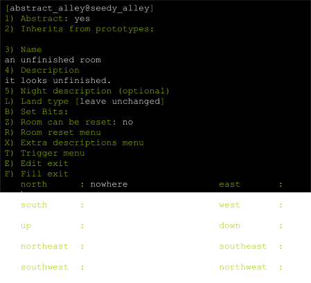

This is your room's blueprint editor! Let's configure it:

#### Option 1: Abstract Toggle 🔄
This should be set to **YES** since we're creating a blueprint, not a walkable room.

#### Option 2: Inheritance 🧬
We're not inheriting from other abstracts right now, so leave this blank.

#### Option 3: Room Name 🏷️
This is what players see when they enter rooms based on this abstract:

```
3
A Narrow, Seedy Alleyway
```

#### Option 4: Room Description 📝
Time to paint a picture with words! Clear the default description and create your own:

```
4
/c
This narrow alleyway stretches between weathered brick buildings, their walls stained with years of urban grime. Rusty fire escapes zigzag up the sides of the structures, some converted into makeshift balconies with potted plants, others supporting bulky air conditioning units. The pavement beneath your feet is cracked and uneven, with weeds pushing through the gaps. The air carries a mixture of cooking smells from nearby restaurants and the faint scent of garbage from overflowing dumpsters.
/f
/q
```

#### Option 5: Night Description 🌙
You can create a separate description for nighttime, but we'll skip this for now.

#### Option L: Terrain Type 🌍
Let's set the terrain type:

```
L
```

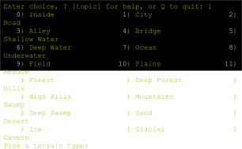

Since we're building an alleyway, option **3** (city street) makes perfect sense:

```
3
```

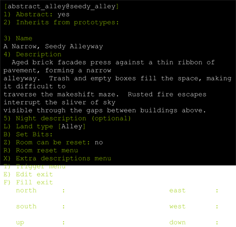

#### Adding Extra Descriptions ✨
Extra descriptions let players examine specific details. Let's add one for the fire escapes mentioned in our description:

```
X
```

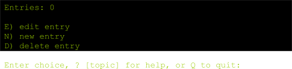

Since we haven't created any yet:

```
N
```

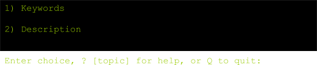

Now let's create our fire escape description:

**Keywords** (what players can examine):
```
1
fire, escape, escapes
```

**Description** (what they see):
```
2
Rusted beyond repair, the fire escapes in this alleyway no longer serve their intended purpose. Some are used as small balconies with potted plants on display while others support heavy air conditioners that protrude from the above windows. Rust streaks down the brickwork of the surrounding buildings at each point where the old escapes have long been bolted.
/f
/q
```

Exit the extra descriptions menu:
```
Q
```

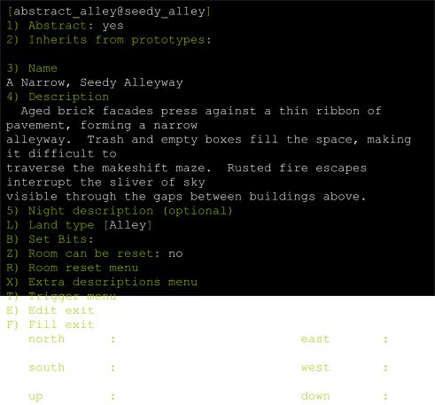

### Finishing Your Abstract 🏁

We'll skip the exit options (E and F) since this is an abstract room - players won't actually walk through it. Option C (extra code) is for advanced building with triggers.

Save your work:
```
Q
Y
```

Let's see our creation:
```
> rlist seedy_alley
```

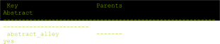

Excellent! Your abstract room is ready to serve as a blueprint for real rooms.

> **🎨 Creative Tip**: Great abstracts capture the essence of a location while leaving room for individual rooms to add their own unique details!

---

## Chapter 3: Real Rooms - Where the Magic Happens ✨

Now for the fun part - creating actual rooms that players can walk through! We'll use our abstract as a foundation and add unique touches to each room.

### Creating Your First Real Room

Let's create the first section of our alley:

```
> redit alley_1@seedy_alley
```

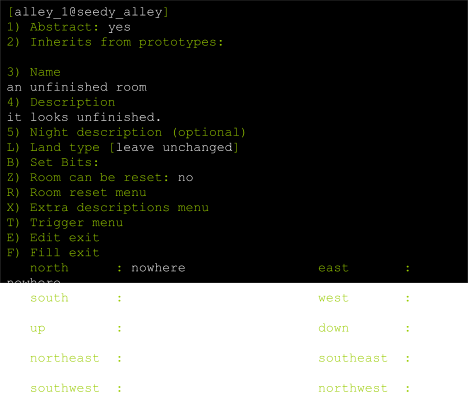

Here's how to set up a real room that inherits from your abstract:

#### Option 1: Abstract Toggle 🔄
Toggle this to **NO** - we want a real, walkable room:
```
1
```

#### Option 2: Inheritance 🧬
Reference our abstract blueprint:
```
2
abstract_alley@seedy_alley
```

#### Option 3: Room Name 🏷️
Enter a **blank line** to inherit the name from our abstract, or enter a unique name if you want this room to be different:
```
3
[press enter for blank line]
```

#### Option 4: Room Description 📝
Clear the default description first. The room will automatically pull the description from your abstract. You can leave it blank to use only the abstract's description, or add additional details:

```
4
/c
A clothesline stretches between the buildings overhead, with various garments swaying gently in the breeze.
/f
/q
```

This adds a unique detail to this specific section while keeping the abstract's base description.

#### Option 5: Night Description 🌙
Optional - leave blank for now.

#### Option L: Terrain Type 🌍
Leave unchanged to inherit from the abstract.

#### Options Z and R: Resets 🔄
We'll configure these later when we have objects and mobiles.

#### Option X: Extra Descriptions ✨
Add a description for the clothesline we mentioned:

```
X
N
1
clothesline, clothes, garments, line
2
The clothesline is strung between two rusty brackets bolted to opposite buildings. Various items of clothing hang from it - a faded blue shirt, some patched trousers, and what looks like a child's dress. They sway gently in the urban breeze, adding a touch of domestic life to the otherwise gritty alleyway.
/f
/q
Q
```

### Save and Repeat 💾

Save your room:
```
Q
Y
```

Now create `alley_2` and `alley_3` using the same process, adding unique details to each section. Maybe `alley_2` has some graffiti on the walls, and `alley_3` has a broken streetlight?

> **🏗️ Builder's Secret**: The combination of abstracts and unique details creates rich, layered environments that feel both cohesive and varied!

---

## Chapter 4: Room Exits - Connecting Your World 🚪

Time to make your rooms walkable! Exits are the pathways that connect your rooms and bring your world to life.

### Testing Your Room 🧪

First, let's visit our creation:

```
> goto alley_1@seedy_alley
```

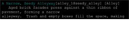

Beautiful! You can see your room description and any extra details you added. But notice something missing? No exits! Let's fix that.

### Creating Basic Exits 🚶‍♂️

Since we're already in the room, we can edit it directly:

```
> redit
```

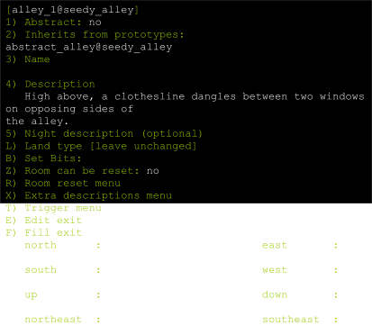

Go to the exits option:

```
E
```


Let's create an exit going east:

```
east
```

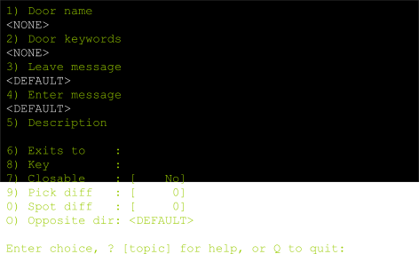

For a simple passage between rooms, we only need to set:

#### Option 6: Destination Room 🎯
```
6
alley_2
```

(Note: We don't need `@seedy_alley` since we're already in that zone!)

The other options are for doors, locks, and special messages - we'll skip those for now.

Exit the menus:
```
Q
Q
Y
```

Now when you look at the room:

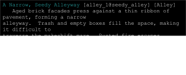

Perfect! You can see "East" listed as an available exit. Now you can walk east to `alley_2`!

### Creating Advanced Exits with Doors 🚪

Let's add something more interesting - a door leading to the tavern from `alley_3`. First, go to `alley_3`:

```
> goto alley_3@seedy_alley
> redit
```

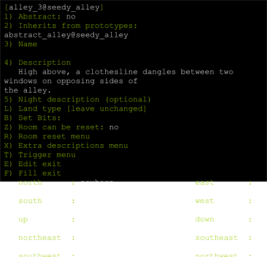

Create a custom exit:

```
E
in
```

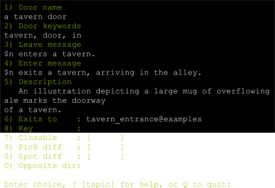

Now let's configure a proper door:

#### Door Configuration 🔧

1. **Keywords**: `door, tavern`
2. **Description**: `A heavy wooden door leads into the tavern.`
3. **Close Message**: `$n closes the tavern door.`
4. **Open Message**: `$n opens the tavern door.`
5. **Door Flags**: Set to closeable and closed
6. **Destination**: `tavern@examples`
7. **Opposite Direction**: `out`

> **💡 Note**: `$n` gets replaced with the player's name in messages!

Since this is a custom direction (`in`), we need to mention it in the room description:

```
Q
4
A heavy wooden door here leads into a tavern.
/f
/q
Q
Y
```

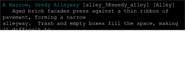

Perfect! Now players can `open door` and `go in` to enter the tavern.

### Don't Forget the Return Trip! 🔄

Remember to create the matching exit from the tavern back to your alley:

```
> goto tavern@examples
> redit
E
out
```

Configure it to lead back to `alley_3@seedy_alley` with direction `in`.

### Exit Building Tips 💡

- **Standard Directions**: north, south, east, west, up, down, northeast, etc.
- **Custom Directions**: in, out, enter, climb, descend, portal, etc.
- **Door Features**: closeable, locked, hidden, pickproof
- **Key Objects**: Any object can serve as a key for locked doors

> **🎮 Player Experience Tip**: Always think about how players will discover and use your exits. Clear descriptions and logical connections make for better gameplay!

---

## Advanced OLC Features 🚀

### Mobile Editing (medit) 🧙‍♂️

Create NPCs and monsters for your world:

```
> medit new guard@seedy_alley
```

Key options:
- **Name**: What players see (e.g., "a burly security guard")
- **Keywords**: What players can target (e.g., "guard, security, man")
- **Description**: What players see when they look at the mobile
- **Race**: Human, elf, dwarf, etc.
- **Level**: Determines the mobile's power
- **Stats**: Strength, intelligence, etc.

### Object Editing (oedit) 🗡️

Create items, weapons, and treasures:

```
> oedit new sword@seedy_alley
```

Key options:
- **Name**: The item's full name
- **Keywords**: What players can reference it by
- **Short Description**: What appears in inventories
- **Long Description**: What players see when they look at it
- **Type**: Weapon, armor, container, food, etc.
- **Weight**: How heavy the item is
- **Value**: How much it's worth

### Reset System 🔄

Make your world dynamic with resets:

```
> redit alley_1@seedy_alley
Z  (toggle zone reset to YES)
R  (enter reset menu)
```

Reset types:
- **Mobile Resets**: Spawn NPCs in rooms
- **Object Resets**: Place items in rooms or give them to mobiles
- **Equipment Resets**: Equip mobiles with gear

---

## Building Best Practices 🌟

### 1. Plan Before You Build 📋
- Sketch out your zone's layout
- Decide on the theme and atmosphere
- Plan connections to other zones

### 2. Use Abstracts Wisely 🧠
- Create abstracts for similar rooms
- Keep abstracts flexible for variations
- Don't over-abstract - some uniqueness is good

### 3. Write Engaging Descriptions ✍️
- Appeal to multiple senses (sight, sound, smell)
- Use specific, vivid details
- Maintain consistent tone and style

### 4. Test Everything 🧪
- Walk through all your exits
- Test doors and locks
- Verify resets work correctly

### 5. Add Interactive Elements 🎯
- Include extra descriptions for interesting details
- Create objects players can interact with
- Add NPCs that enhance the atmosphere

### 6. Consider Player Flow 🌊
- Make navigation intuitive
- Provide clear landmarks
- Avoid dead ends without purpose

---

## Troubleshooting Common Issues 🔧

### "Room not found" Errors
- Check your spelling and zone names
- Ensure the destination room exists
- Verify you're using the correct syntax

### Exits Not Working
- Make sure both directions are set up
- Check that door flags are correct
- Verify the destination room key

### Inheritance Problems
- Ensure abstract rooms are marked as abstract
- Check that parent room exists
- Verify the inheritance syntax

### Reset Issues
- Confirm zone reset timer is set
- Check that rooms are marked for reset
- Verify mobile and object keys exist

---

## Quick Reference Commands 📚

### Zone Commands
- `zlist` - List all zones
- `zedit new <key>` - Create new zone
- `zedit <key>` - Edit existing zone

### Room Commands
- `rlist <zone>` - List rooms in zone
- `redit <key@zone>` - Create/edit room
- `redit` - Edit current room
- `goto <key@zone>` - Go to room

### Mobile Commands
- `mlist <zone>` - List mobiles in zone
- `medit <key@zone>` - Create/edit mobile

### Object Commands
- `olist <zone>` - List objects in zone
- `oedit <key@zone>` - Create/edit object

### Editor Commands
- `/c` - Clear all text
- `/f` - Format text
- `/q` - Quit editor
- `/s` - Show current text

---

## Conclusion: You're Ready to Build! 🎉

Congratulations! You've learned the fundamentals of NakedMud's OLC system. You now know how to:

- Create and configure zones
- Build abstract and real rooms
- Connect rooms with exits and doors
- Add interactive elements and descriptions

Remember, great building comes with practice. Start small, experiment freely, and don't be afraid to make mistakes - that's how you learn!

Your players are waiting to explore the amazing worlds you'll create. Now go forth and build something awesome! 🏗️✨

---

*Happy Building!*  
*- The NakedMud Community*

> **📖 Further Reading**: Check out the other documentation files for advanced topics like Python scripting, triggers, and extending the codebase!
